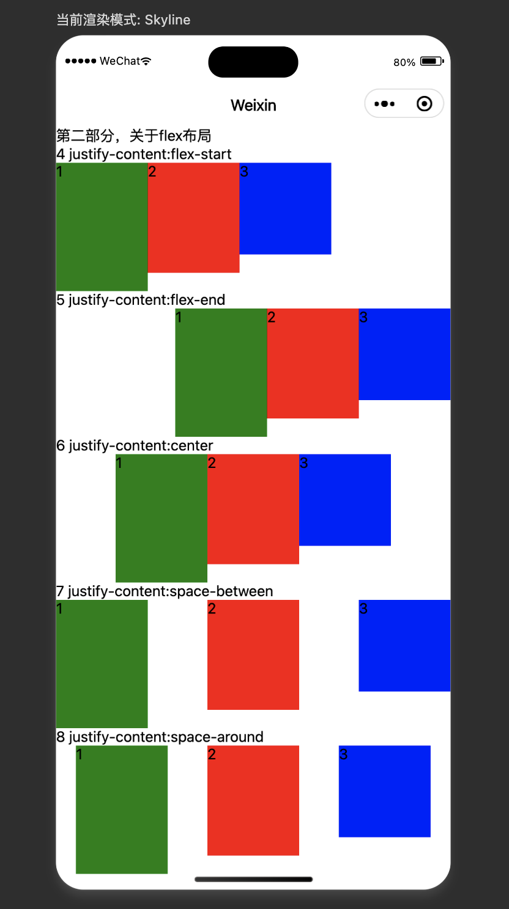
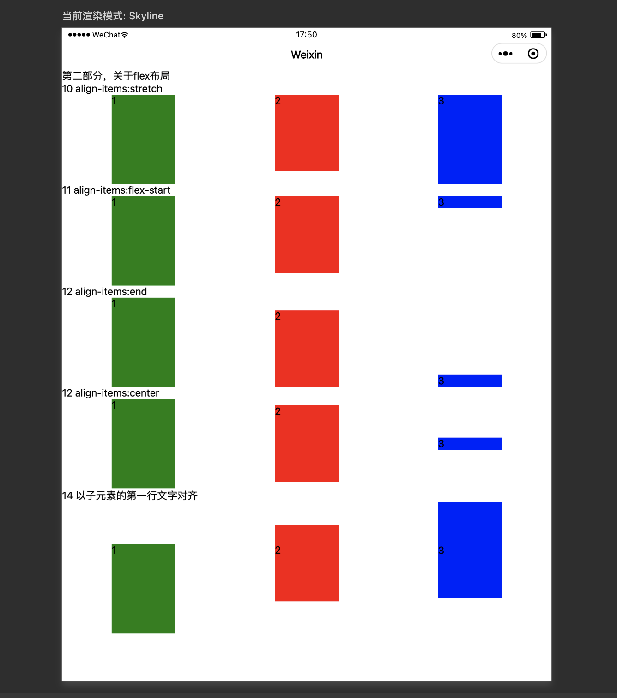
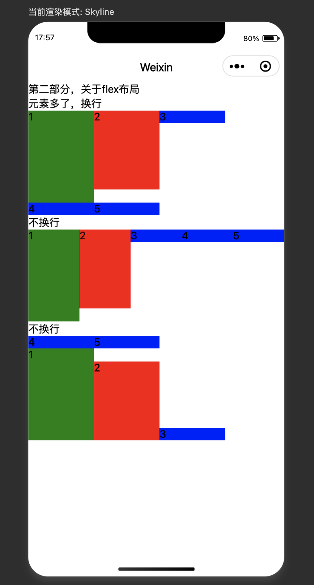
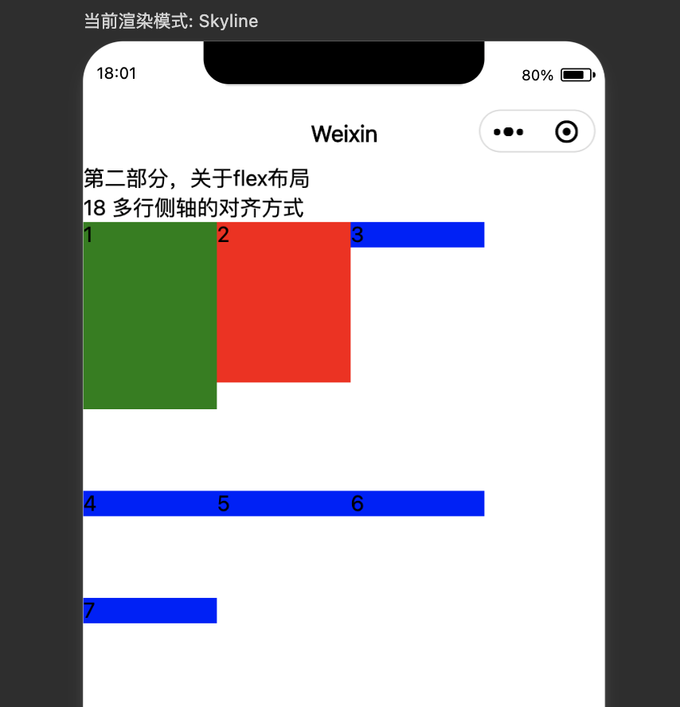
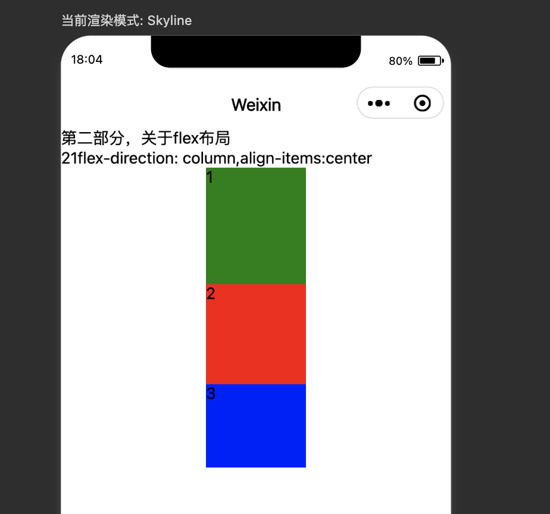

# view容器组件及Flex布局

[toc]


## 一、链接

[view容器组件：https://developers.weixin.qq.com/miniprogram/dev/component/view.html](https://developers.weixin.qq.com/miniprogram/dev/component/view.html)。

思考：

在苹果系统中有一个重要的功能设计：在 HTML5 网页上单击链接或者按钮，会明显感觉到有一个卡顿，有 300 毫秒的延迟。

而小程序里的单机事件没有 300 毫秒的延迟。

## 二、什么是容器组件

所谓容器组件，就像 HTMI 5 里面的 DIV 标签一样，是为容纳其他组件而存在的，它本身也可以有些自己的样式，但它最主要的功能是布局这个容器组件。

view 是最基础的，也是微小程序第一个公布的容器组件。

## 三、view容器组件的属性

- `hover-class`  指定按下去的样式类,让容器有一个单击效果。当 `hover-class="none"` 时，或者没有设置这个属性时，没有点击态效果。

  单击再松开手指以后，容器组件恢复之间的状态。
  
  ```html
  <view hover-class="bc_red" class="section_title"></view>
  ```
  
  示例：
  
  ```
    <!-- 2 示例 -->
  <view class="section">
  	<view class="gap">2 示例</view>
  	<view hover-class="bc_red" class="section__title">content</view>
  </view>
  
  /* 2 */
  .bc_red {
    background: red;
    width: 100px;
    height: 120px;
  }
  ```
  
  `hover-class` 这个属性名称有一定的迷惑性。在 h t m l 开发中， mousehover 事件指的是鼠标悬停事件，honver有悬停的意思， mousedown 才是鼠标按下去的事件。在 Flash Action Script3.0 开发中，鼠标按下去显示的帧也是 mousedown 这一帧。
  
- `hover-stop-propagation`  指定是否阻止本节点的祖先节点出现点击态，默认为 false 不阻止。从示例代码可以看到，有两个 view 容器，里边那个子容器使用了 hover stop propagation 属性，由于它是一个布尔属性，只要写上属性名字，不填写属性值也是可以的，也代表真。如果写属性值的话，还要使用布尔值绑定，直接写一个字符串 true 是不行的。

  ```
  <view class="section">
  	<view class="gap">3 示例</view>
  	<!-- 阻止父节点出现hover状态 -->
  	<view hover-class="bc_red" class="section__title">
  		parent
  		<view hover-stop-propagation hover-class="bc_green" class="section__title">
  			child view
  		</view>
  	</view>
  </view>
  ```

  ` hover-stop-propagation` 这个属性的迷惑性，官方文档指定是否阻止本节点的祖先节点出现点击态。这个描述是很专业的，虽然是单基态，但并不能理解为是  `press-stop-propagation` 或者 `click-stoppropagation`，虽然它是这个意思。现在我们通过跟踪父子组件的 tap事件，验证一下 `hover-stop-propagation` 这个属性的作用。

  ```
  <view class="section">
  	<view class="gap">4 示例 事件三阶段</view>
  	<!-- 阻止父节点出现hover状态 -->
  	<view id="parentView" bindtap="onTap" hover-class="bc_red" class="section__title">
  		parent
  		<view id="childView" bindtap="onTap" hover-stop-propagation hover-class="bc_green" class="section__title">
  			child view
  		</view>
  	</view>
  </view>
  ```

  ```javascript
  // 片 4
  onTap(e){
      console.log(e.target)
    }
  ```

  在示例中，我们给两个view，一对儿父子容器同时绑定 tap事件，为方便追踪，为父子容器都分配了ID，父容器 ID 是 parentview，子容器是 childview。单击一次，父容器输出一次，但单击一次，子容器却输出两次，那为什么会输出两次？为什么会触发两次的 tap事件？

  这是因为**每个事件它都有捕捉、目标与冒泡三个阶段**。在 Vue 视图容器上使用bind绑定的事件，默认会在目标与冒泡这两个阶段派发事件。

  子组件的冒泡事件默认会向上传递。` hover-stop-propagation` 这个属性就是为了阻止父组件出现 hover-class 样式，但是它还不能阻止冒泡事件向上传递。当设置这个属性以后，这时候我们点击子组件仍然是可以看到两次输出的。

  那么我们可以让子容器 view 的 type 事件只派发一次吗？

  可以使用 catch 绑定事件函数， catch 与 bind 的作用相同，与 bind 的不同的是 catch 会阻止事件向上冒泡。

  catch是在事件的捕捉阶段监听事件的。将bindtap 改为了 catchtap，这样单击子容器组件的时候便不会输出两次了。

  ```html
  <!-- 5 子组件只输出一次-->
  <view class="section">
  	<view class="gap">5 示例</view>
  	<!-- 阻止父节点出现hover状态，阻止冒泡 -->
  	<view id="parentView" bindtap="onTap" hover-class="bc_red" class="section__title">
  		parent
  		<view id="childView" catchtap="onTap" hover-stop-propagation hover-class="bc_green" class="section__title">
  			child view
  		</view>
  	</view>
  </view>
  ```

  

-  `hover-start-time`， 按住后多久出现点击态，单位毫秒

- `hover-stay-time` 手指松开后点击态保留时间，单位毫秒。

  没有特殊说明，微信小程序里面所有属性的时间单位都是毫秒。这两个属性的设置说明在 view 容器组件内部有代码，肯定做了掐表，做了定时。当 touchstart 事件发生时，开始计时，到达hover-start-time时，应用 hover-class 样式。当 touchstart 事件结束，即 touchend 的事件发生时， 开始hover-stay-time的倒计时，时间到则移除  hover-class 样式。

  设置hover-start-time属性是为了方便开发者控制 hover-class 样式出现的时机。在测试中我们发现但凡在 view 上单击一下，很正常的一个速度，单击不需要悬停也会出现 hover-class 样式的应用。50 毫秒是它的一个默认时间，这是一个极短的时间，但是在计算机的这个微观时间里面，这也是一个极长的时间，这个时间已经足以包括一次系统单机事件了。单机事件不是一个点事件，它是一个跨度一定时间段的物理事件。我们以mac系统为例，系统设置里面有一个地方可以改变单机事件的跟踪速度，改变这个跟踪速度以后，在微信开发者工具里面，模拟器里面的 APP 事件也会受到影响。如果我们把跟踪输入调整到快的一侧，单击时只是轻轻慢慢的一点按，那么系统是不会触发单机事件的。

当延迟超过 100 毫秒的时候，用户就会感觉到界面有明显的卡顿，但是在移动设备上，特别是苹果的 Safari 浏览器上，我们不得不忍受 300 毫秒的延迟，这是为什么呢？苹果创始人乔布斯在 2007 年 iPhone 发布会上演示过这样一个功能，对于一个 Safari 浏览器网页在内容区快速单击，苹果会帮助我们准确定位到文章的主体内容，并将其放大。那这个功能很酷，但是它是有代价的。如果用户不小心在双击时接到了一个链接，这样软件怎么去处理？是马上跳转还是等待用户的另外一次单击？不然他没有办法判断是不是双击事件。

苹果采用的是第二种方式，所有的 Safari 中的链接都要延迟300毫秒，用这种方式观察用户是不是还要发出第二次单机事件。如果没有再跳转这个链接，这导致苹果手机中的 HTML 网页里面的单机反应都有一点迟钝。但是在微信小程序里没有这个问题。  `hover-start-time`默认时间是 50 毫秒，只需要 50 毫秒甚至更短的时间就可以触发单击事件。微信小程序已经迈过了 300 毫秒的延迟的限制。如果有人问你，使用微信小程序开发产品，相比 html5 开发有什么优势？没有单击延迟，这就是在体验上一个很大的优势。

## 四、 `hover-class`属性的应用

我们可以基于 `hover-class`这个属性实现按钮，示例中三个按钮均是基于 button 组件改造的， button 是一个组件，同时实际上它也是一个容器，所以可以把 button 当成 view 来使用。在 button 上面也可以应用`hover-class`属性，虽然它的属性文档里面没有标明，但是也可以这样去用。

```
    <!-- 8 -->
    <view class="section">
        <view class="gap">8 按钮示例</view>
        <!-- 普通按钮 -->
        <view class="section">
            <button class="btn" type="primary">完成</button>
        </view>
        <!-- 圆形按钮 -->
        <view class="section">
            <button hover-class="circle-btn__hover_btn">
                <icon type="success" size="80px"></icon>
            </button>
        </view>
        <!-- 距形按钮 -->
        <view class="section">
            <button type="default" class="btn" plain hover-class="rect-btn__hover_btn">
                <icon type="success_no_circle" size="26px"></icon>
                完成
            </button>
        </view>
    </view>
```

```css
/* 8 */
.btn{
  display: flex;
  align-items: middle;
  padding: 8px 50px 8px;
  border: 1px solid #b2b2b2;
  background-color: #f2f2f2;
  width:auto;
}
/* 圆角按钮 */
.circle-btn__hover_btn {
  opacity: 0.8;
  transform: scale(0.95, 0.95);
}
/* 方框按钮 */
.rect-btn__hover_btn {
  position: relative;
  top: 3rpx;
  left: 3rpx;
  box-shadow: 0px 0px 8px rgba(175, 175, 175, .2) inset;
}
```

这三个按钮主要实现了三个 `hover-class`样式：

第一个样式，`.btn` 是普通的自定义按钮样式， flex与 align-items 是为了实现文本与图标的横向对齐，这是 flex 布局方面的内容，稍后我们会有详细的介绍。`#b2b2b2`这个颜色值是符合微信设计规范的，按钮边框色。`#f2f2f2`是按钮的背景色。

第二个样式， transform 是圆形按钮在单击时缩小 0.05，按钮单击式微微缩小。这是从 Flash 交互时代传承下来的体验技巧，包括 0.05 这个数值也是在交互中在当时也是经常使用的。

第三个样式， `#b2b2b2`颜色值作为边框色，以它的 RGBA 格式的 20% 透明格式，将它作为方形按钮，按一下时状态的内阴影颜色，这也是符合微信颜色设计规范的。 `box-shadow` 这个样式用于定义组件的内阴影。

## 五、flex布局

基本所有常见的布局都可以使用 view 来实现。 Vue 容器组件最大的作用就是实现 UI 布局。最常用的是 Flex 布局，是将 display 样式设置为Flex，再加以其他相关的样式实现的布局。

### （1）flex布局的三个样式

关于 Flex 布局有三个十分重要的样式：

第一个 justify-content 调整内容在主轴方向的排列方式。

第二个 align-items 对齐元素在辅轴方向的对齐方式。

第三个 align-content 对齐多行内容在辅轴方向上的排列方式。

什么是主轴？什么是辅轴？主轴是 x 轴吗？辅轴是 y 轴吗？一定条件一下是这样的，但是不能这样简单理解。

以默认的 flex-direction设置为row 来看，从左到右是主轴，自上而下是侧轴，也叫辅轴。在这种情况下， justify-content 管制的是元素在 x 方向的排列策略。 align-items管制的是主轴上排列的元素在侧轴方向及 y 方向的对齐方式。align-content管制的是当出现多行以后，多行内容在辅轴方向上及轴方向上的排列策略。

排列和对齐：

这里涉及到两个词汇，一个是排列，一个是对齐。当我们讲排列时，一般指两个和多个元素，它们间隔多少。当我们讲对齐时，一般指多个元素它们的两边或者中心线对齐的方式。

这 3 个属性很不好记，一时记住了，过一段时间用的时候可能还要查文档。可以用以下的方法辅助记忆：

第一点，在默认的以 x 轴为主轴的情况下， flex-direction设置为row ， justify 单词的意思为调整或者是排列。CSS 样式text-align有一个值是justify，它的意思是左右横向两端对齐，这里的 justify 也是横向调整的意思。至于content，它比 items 的字面宽，更能代表行的意思。

第二点，负责元素排列与对齐的样式。除了  justify-content 就是  align-items 。既然   justify-content 负责的是横向排列调整，那么 align-items 负责的就是纵向对齐了。

第三点，至于 align-content，结合  align-items 与 justify-content来记忆， align 指的是纵向对齐， content 指的是行，那么 align-content指的就是多行的纵向排列方式。

第四点，当flex-direction为 column 时，纵向是主轴，横向是侧轴。策略它们是类似的。

下面我们分别看一下这几个样式的作用。

### （2）justify-content 样式的五个值

第一个样式，justify-content，它有 5 个值：

第一个值，flex-start，这是默认值。严肃向主轴的起点看起，与 flex-start对应的值是 flex-end， flex-end是元素，向终点看齐。

第二个值， flex-end，元素在主轴方向上向尾部看齐。

第三个值， center， 在主轴方向上居中对齐，有空白再往首尾方向放。

第四个值， space-between，向首尾看起，相当于 align-text 的 justify 效果。两端子元素靠向父容器两端，其他子元素之间的间隔相等，元素周围是不留空间的。我们看到的效果图周围有间隔，那是外层容器的padding效果。

第五个指 space-around 空白在周围均匀分布，元素之间的间隔与父容器之间的间隔是相同的。在视图效果中，两边间隔较多一点，这也是因为外容器本身已经有了一个padding边距。

以上就是 justify-content 样式的每个值。

```
    <!-- 4 flex-start -->
    <view class="section">
        <view class="section__title">4 justify-content:flex-start</view>
        <view class="flex-wrp" style="flex-direction:row;;justify-content:flex-start">
            <view class="flex-item bc_green">1</view>
            <view class="flex-item bc_red">2</view>
            <view class="flex-item bc_blue">3</view>
        </view>
    </view>
    <!-- 5 flex-end -->
    <view class="section">
        <view class="section__title">5 justify-content:flex-end</view>
        <view class="flex-wrp" style="flex-direction:row;justify-content:flex-end">
            <view class="flex-item bc_green">1</view>
            <view class="flex-item bc_red">2</view>
            <view class="flex-item bc_blue">3</view>
        </view>
    </view>
    <!-- 6 center -->
    <view class="section">
        <view class="section__title">6 justify-content:center</view>
        <view class="flex-wrp" style="flex-direction:row;justify-content:center">
            <view class="flex-item bc_green">1</view>
            <view class="flex-item bc_red">2</view>
            <view class="flex-item bc_blue">3</view>
        </view>
    </view>
    <!-- 7 space-between -->
    <view class="section">
        <view class="section__title">7 justify-content:space-between</view>
        <view class="flex-wrp" style="flex-direction:row;justify-content:space-between">
            <view class="flex-item bc_green">1</view>
            <view class="flex-item bc_red">2</view>
            <view class="flex-item bc_blue">3</view>
        </view>
    </view>
    <!-- 8 space-around -->
    <view class="section">
        <view class="section__title">8 justify-content:space-around</view>
        <view class="flex-wrp" style="flex-direction:row;justify-content:space-around">
            <view class="flex-item bc_green">1</view>
            <view class="flex-item bc_red">2</view>
            <view class="flex-item bc_blue">3</view>
        </view>
    </view>
```



### （3） align-items 样式的五个值

接下来我们看一看 align-items 样式的值，它们有一些值在语义上是类似的。align-items 这个样式也有 5 个值：

第一个指stretch，是拉伸填满整个容器，这是默认值。在示例代码中， bc_blue 样式本身有一个height设置，我们为了让第三个子元素可以自由缩放，所以给它设置了 height 样式为 auto。style内联样式的优先级是高于 class 类样式的，所以这个内联样式设定是起作用的。第一个元素与第三个元素均填充了整个父容器。在使用 Stretch 这个值时，高度取决于最大的那一个，其他次高元素必须在高度上可以自由伸缩，这样 stretch 这个词才可以发挥它的作用。此元素不可以有height、min-height 等样式的束缚。

第二个指 flex-start，在辅轴方向上向起点对齐，在默认 x 轴为主轴的情况下，效果看起来就是顶部对齐。

第三个值 flex-end，这个值是向辅轴的终点看齐，当 y 轴为辅轴时，就是底部齐。

第四个值center，这个值在辅轴中居中对齐。从效果中我们可以看到三个色块在横向上是居中的。

第五个指baseline，这个值是以子元素的第一行文字对齐的，前面的flex-start， flex-end、enter 都是与元素本身所占的区域来定位的，只有 baseline 是以内部的文本去定位的，为了使 baseline 对齐的效果明显，在源码中，我们特意给第二、第三个元素设置了不一样的属性。在效果中可以看到 1、2、3，三个文本在一条直线上，这是 baseline 在起作用。这个特性在设置一些文本居中显示的 UI 效果时很有用。 无论文本周围有什么样的装饰效果，文本始终是在一条线上显示的。

```css
.bc_blue {
  background: blue;
  width: 100px;
  height: 100px;
}

.bc_red {
  background: red;
  width: 100px;
  height: 120px;
}
.bc_green {
  background: green;
  width: 100px;
  height: 140px;
}
```

```
    <!-- 10 -->
    <view class="section">
        <view class="section__title">10 align-items:stretch</view>
        <view class="flex-wrp" style="flex-direction:row;justify-content:space-around;align-items:stretch;">
            <view class="flex-item bc_green">1</view>
            <view class="flex-item bc_red">2</view>
            <view style="height:auto;" class="flex-i÷tem bc_blue">3</view>
            <!-- <view class="flex-item bc_blue">3</view> -->
        </view>
    </view>
    <!-- 11 -->
    <view class="section">
        <view class="section__title">11 align-items:flex-start</view>
        <view class="flex-wrp" style="flex-direction:row;justify-content:space-around;align-items:flex-start;">
            <view class="flex-item bc_green">1</view>
            <view class="flex-item bc_red">2</view>
            <view style="height:auto;" class="flex-item bc_blue">3</view>
        </view>
    </view>
    <!-- 12 -->
    <view class="section">
        <view class="section__title">12 align-items:end</view>
        <view class="flex-wrp" style="flex-direction:row;justify-content:space-around;align-items:flex-end;">
            <view class="flex-item bc_green">1</view>
            <view class="flex-item bc_red">2</view>
            <!-- <view style="height:auto;" class="flex-item bc_blue">3</view> -->
            <view style="height:auto;" class="flex-item bc_blue">3</view>
        </view>
    </view>
    <!-- 13 -->
    <view class="section">
        <view class="section__title">12 align-items:center</view>
        <view class="flex-wrp" style="flex-direction:row;justify-content:space-around;align-items:center;">
            <view class="flex-item bc_green">1</view>
            <view class="flex-item bc_red">2</view>
            <view style="height:auto;" class="flex-item bc_blue">3</view>
        </view>
    </view>
    <!-- 14 -->
    <view class="section">
        <view class="section__title">14 以子元素的第一行文字对齐</view>
        <view class="flex-wrp" style="flex-direction:row;justify-content:space-around;align-items:baseline;">
            <view class="flex-item bc_green">1</view>
            <view style="padding-top:30px;" class="flex-item bc_red">2</view>
            <view style="height:auto;line-height:150px;" class="flex-item bc_blue">
                <text>3</text>
            </view>
        </view>
    </view>
```



### （4） flex-wrap 样式的值

下面我们看 flex-wrap 的值， flex-wrap 这个样式是为了控制主轴一行显示不了的时候的换行策略的，它有三个值：

第一个值 no-wrap，不换行，这也是默认值。

第二个值 wrap ，换行；

第三个是 wrap-reverse 换行，但是第一行在最下面，这是反向的一种换行。

默认不换行的情况下，便于实现多种子元素横向滚动的效果。

我们接下来看一看换行的效果。从效果中可以看到，容器宽度不够的情况下会自动折到下一行显示，如果动态增加宽度，子元素又会自动折回到上一行来显示。这种特性方便实现一些瀑布流效果，不限定瀑布流显示几列，可以动态调整为 3 列或者是 4 列都是可以的。

```
    <!-- 16 -->
    <view class="section">
        <view class="section__title">元素多了，换行</view>
        <view class="flex-wrp" style="flex-direction:row;justify-content:flex-start;align-items:baseline;flex-wrap:wrap;">
            <view class="flex-item bc_green">1</view>
            <view class="flex-item bc_red">2</view>
            <view style="height:auto;" class="flex-item bc_blue">3</view>
            <view style="height:auto;" class="flex-item bc_blue">4</view>
            <view style="height:auto;" class="flex-item bc_blue">5</view>
        </view>
    </view>
    <view class="section">
        <view class="section__title">不换行</view>
        <view class="flex-wrp" style="flex-direction:row;justify-content:flex-start;align-items:baseline;flex-wrap:no-wrap;">
            <view class="flex-item bc_green">1</view>
            <view class="flex-item bc_red">2</view>
            <view style="height:auto;" class="flex-item bc_blue">3</view>
            <view style="height:auto;" class="flex-item bc_blue">4</view>
            <view style="height:auto;" class="flex-item bc_blue">5</view>
        </view>
    </view>
        <view class="section">
        <view class="section__title">反向换行换行</view>
        <view class="flex-wrp" style="flex-direction:row;justify-content:flex-start;align-items:baseline;flex-wrap:wrap-reverse;">
            <view class="flex-item bc_green">1</view>
            <view class="flex-item bc_red">2</view>
            <view style="height:auto;" class="flex-item bc_blue">3</view>
            <view style="height:auto;" class="flex-item bc_blue">4</view>
            <view style="height:auto;" class="flex-item bc_blue">5</view>
        </view>
    </view>
```



### （5） align-content 样式的值

接下来我们看 align-content 的值。通过前面justify-content，align-items 两个样式可以看出来具有相同名称的值，它们的含义也是相似的，例如 flex-start、flex-end、center 这三个值都是这样的。align-content 是为了控制多行在侧轴方向上的排列方式。

align-content 的有效样式值：stretch、center、flex-start、flex-end、space-between、space-around。

这些样式值在前面都出现过，在这里代表的含义与前面也是类似的。

下面的图片是 space -between 的运行效果，可以看到三行之间的间隔是相等的。

```
<!-- 18 -->
<view class="section">
	<view class="section__title">18 多行侧轴的对齐方式</view>
	<view class="flex-wrp" style="flex-direction:row;justify-content:flex-start;align-items:baseline;flex-wrap:wrap;align-content:space-between;height:300px;">
		<view class="flex-item bc_green">1</view>
		<view class="flex-item bc_red">2</view>
		<view style="height:auto;" class="flex-item bc_blue">3</view>
		<view style="height:auto;" class="flex-item bc_blue">4</view>
		<view style="height:auto;" class="flex-item bc_blue">5</view>
		<view style="height:auto;" class="flex-item bc_blue">6</view>
		<view style="height:auto;" class="flex-item bc_blue">7</view>
	</view>
</view>
```



### （6）flex-direction 样式的值

接下来我们来看flex-direction 的值。还有一个样式，在 Flex 布局中不得不提就是 flex-direction，它用于决定是 x 轴还是 y 轴，是主轴。

默认情况下，也就是前面所讲的情况是以 x 轴为主轴的。如果将 flex-direction 的值设置为column，色块是纵向排列的。值得一提的是，如果将 y 轴定义为主轴的话，决定元素横向排列的就不是justify-content 了，而是 align-items。

从源码看到，我们将辅轴方向上的对齐方式使用 align-items 设置为center，这时候 x 轴为辅轴，所以元素表现为左右居中。 

flex-direction 一共有四个值：

第一个，row，从左到右的水平方向为主轴，是默认值。

第二个，row-reverse，从右到左的水运方向为主轴，是入的反方向。

第三个，column ，从上到下的垂直方向为主轴。

第四个， column-reverse，从下到上的垂直方向为主轴，是 column 的反方向。 

row-reverse 与 rule 相反，是元素在横向上从右到左排列。  column-reverse 与 column 相反，是元素从下向上排。

```
    <!-- 21 -->
    <view class="section">
        <view class="section__title">21flex-direction: column,align-items:center</view>
        <view class="flex-wrp" style="height: 300px;flex-direction:column;align-items:center;">
            <view class="flex-item bc_green">1</view>
            <view class="flex-item bc_red">2</view>
            <view class="flex-item bc_blue">3</view>
        </view>
    </view>
```



## 六、flex相关的技术问题

### （1）如何把 view 上的内容绘制到画布上，生成一张海报？ 

view 目前不能直接转绘到画布上。如果想生成海报，一种可行的办法是这样的:

第一，先使用 `wx.createCanvasContext` 创建一个画布。

第二，接着在画布上绘制内容文本或者是图片。

第三，在接着通过 `wx.canvasToTempFilePath` 保存到本地，并获取一个临时图片路径。

第四，最后通过 `wx.saveImageToPhotosAlbum` 保存临时文件到本地相册里。

在这里有一个开源的小程序组件[painter：https://github.com/Kujiale-Mobile/Painter](https://github.com/Kujiale-Mobile/Painter)，那么通过 JSON 数据绘制海报的功能，本课源码中也集合了这个组件，可以通过源码查看运行效果。单击保存按钮就可以将海报保存到本地了。

参考：

[小程序 | canvas 2d篇](https://blog.csdn.net/zerobiu/article/details/130679981)

[【微信小程序】配置合法域名](https://www.jianshu.com/p/308fd654846a)

## 七、作业

### （1） `hover-start-time`，这个属性的值最小可以设置为多少？设置为 1 毫秒可以吗？为什么？

答案是可以设置的，但是设置了也没有效果。因为在小程序当中，所有效果都受限于小程序它本身的渲染帧率，每秒渲染 60 帧，每帧用时大概是 17 毫秒，所以设置成 1 毫秒或者 17 毫秒，它的效果是一样的，没有区别。

### （2）使用前面提到的 painter 组件，在小程序里面生成一张自己的海报。

