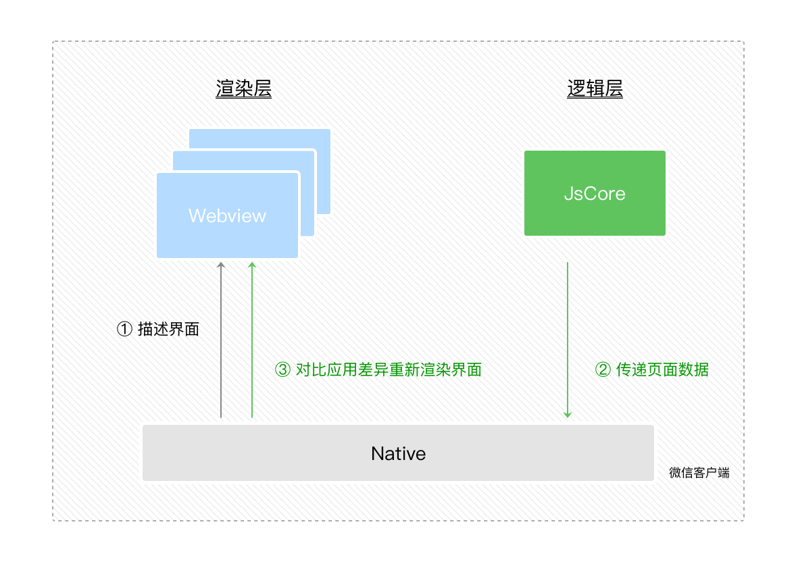

# 小程序的宿主环境

[toc]

## 一、什么事宿主环境

微信客户端给小程序所提供的宿主环境，简称为宿主或者宿主环境。

## 二、渲染层和逻辑层

渲染层和逻辑层：

1.（数据驱动）渲染层和数据相关。
2.逻辑层负责产生、处理数据。
3.（通信模型）逻辑层通过 Page 实例的 setData 方法传递数据到渲染层。

### （1）通信模型

- 渲染层的界面使用了WebView 进行渲染， 一个小程序存在多个界面，所以渲染层存在多个WebView线程；
- 逻辑层采用JsCore线程运行JS脚本；

- 两个线程的通信会经由微信客户端（下文中也会采用Native来代指微信客户端）做中转；


### （2）数据驱动

WXML可以先转成JS对象，然后再渲染出真正的Dom树。

通过setData把msg数据从“Hello World”变成“Goodbye”，产生的JS对象对应的节点就会发生变化，此时可以对比前后两个JS对象得到变化的部分，然后把这个差异应用到原来的Dom树上，从而达到更新UI的目的，这就是“数据驱动”的原理。

### （3）双线程渲染

- 小程序的逻辑层和渲染层是分开的两个线程。
- 在渲染层，宿主环境会把WXML转化成对应的JS对象；
- 在逻辑层发生数据变更的时候，我们需要通过宿主环境提供的setData方法把数据从逻辑层传递到渲染层，再经过对比前后差异，把差异应用在原来的Dom树上，渲染出正确的UI界面；



## 三、程序和页面

### （1）程序构造器`App()`

- 宿主环境提供了 App() 构造器用来注册一个程序App;

- App() 构造器必须写在项目根目录的app.js里;

- App实例是单例对象;

- 在其他JS脚本中可以使用宿主环境提供的 getApp() 来获取程序实例；

  ```javascript
  // other.js
  var appInstance = getApp()
  ```

### （2）App实例的生命周期函数

App构造器接受一个Object参数：

```
App({
  onLaunch: function(options) {}, // 当小程序初始化完成时，会触发 onLaunch（全局只触发一次）
  onShow: function(options) {},  // 当小程序启动，或从后台进入前台显示，会触发 onShow
  onHide: function() {},         // 当小程序从前台进入后台，会触发 onHide
  onError: function(msg) {},     // 当小程序发生脚本错误，或者 API 调用失败时，会触发 onError 并带上错误信息
  globalData: 'I am global data'  // 可以添加任意的函数或数据到 Object 参数中，在App实例回调用 this 可以访问
})
```

所有页面的脚本逻辑都跑在同一个JsCore线程，页面使用setTimeout或者setInterval的定时器，然后跳转到其他页面时，这些定时器并没有被清除，需要开发者自己在页面离开的时候进行清理。

### （3）页面构造器`Page()`

- 宿主环境提供了 Page() 构造器用来注册一个小程序页面。

- Page构造器接受一个Object参数

  ```javascript
  Page({
    data: { text: "This is page data." },
    onLoad: function(options) { },  // 生命周期函数--监听页面加载，触发时机早于onShow和onReady
    onReady: function() { },   // 生命周期函数--监听页面初次渲染完成
    onShow: function() { },   // 生命周期函数--监听页面显示，触发事件早于onReady
    onHide: function() { },    // 生命周期函数--监听页面隐藏
    onUnload: function() { },   // 生命周期函数--监听页面卸载
    onPullDownRefresh: function() { },  // 页面相关事件处理函数--监听用户下拉动作
    onReachBottom: function() { },     // 页面上拉触底事件的处理函数
    onShareAppMessage: function () { },  // 用户点击右上角转发
    onPageScroll: function() { }          // 页面滚动触发事件的处理函数
  })
  ```

  - onLoad在页面没被销毁之前只会触发1次
  - 页面显示之后，Page构造器参数所定义的onShow方法会被调用，一般从别的页面返回到当前页面时，当前页的onShow方法都会被调用。
  - 在页面初次渲染完成时，Page构造器参数所定义的onReady方法会被调用，onReady在页面没被销毁前只会触发1次，onReady触发时，表示页面已经准备妥当，在逻辑层就可以和视图层进行交互了。

  > 三个事件触发的时机是onLoad早于 onShow，onShow早于onReady。

  - 页面不可见时，Page构造器参数所定义的onHide方法会被调用，这种情况会在使用wx.navigateTo切换到其他页面、底部tab切换时触发。
  - 当前页面使用wx.redirectTo或wx.navigateBack返回到其他页时，当前页面会被微信客户端销毁回收，此时Page构造器参数所定义的onUnload方法会被调用。

  **我们不应该在其他代码中主动调用Page实例的生命周期函数。**

### （4）页面的数据`setData(data, callback)`

- setData传递数据实际是一个异步的过程；

- setData的第二个参数是一个callback回调，在这次setData对界面渲染完毕后触发；

- setData其一般调用格式是 `setData(data, callback)`

  ```
  this.setData({
        text: 'change data'
      }, function(){
        // 在这次setData对界面渲染完毕后触发
      })
  ```

- 不需要每次都将整个data字段重新设置一遍，你只需要把改变的值进行设置即可；

  **每次只设置需要改变的最小单位数据**

1. 直接修改 Page实例的this.data 而不调用 this.setData 是无法改变页面的状态的，还会造成数据不一致。
2. 由于setData是需要两个线程的一些通信消耗，为了提高性能，每次设置的数据不应超过1024kB。
3. 不要把data中的任意一项的value设为undefined，否则可能会有引起一些不可预料的bug。

### （5）页面的用户行为：下拉刷新、上拉触底、页面滚动 、用户转发

1. 下拉刷新 onPullDownRefresh
   监听用户下拉刷新事件，需要在app.json的window选项中或页面配置page.json中设置enablePullDownRefresh为true。当处理完数据刷新后，wx.stopPullDownRefresh可以停止当前页面的下拉刷新。

2. 上拉触底 onReachBottom
   监听用户上拉触底事件。可以在app.json的window选项中或页面配置page.json中设置触发距离onReachBottomDistance。在触发距离内滑动期间，本事件只会被触发一次。

3. 页面滚动 onPageScroll
   监听用户滑动页面事件，参数为 Object，包含 scrollTop 字段，表示页面在垂直方向已滚动的距离（单位px）。

4. 用户转发 onShareAppMessage
   只有定义了此事件处理函数，右上角菜单才会显示“转发”按钮，在用户点击转发按钮的时候会调用，此事件需要return一个Object，包含title和path两个字段，用于自定义转发内容：

   ```javascript
   // page.js
   Page({
   onShareAppMessage: function () {
    return {
      title: '自定义转发标题',
      path: '/page/user?id=123'
    }
   }
   })
   ```

### （6）页面的路由和跳转

#### （1）页面栈

一个小程序拥有多个页面，我们可以通过wx.navigateTo推入一个新的页面，把一个页面层级称为页面栈。

小程序宿主环境限制了这个页面栈的最大层级为10层 ，也就是当页面栈到达10层之后就没有办法再推入新的页面了。

页面栈：[ pageA, pageB, pageC ]，其中pageA在最底下，pageC在最顶上，也就是用户所看到的界面。

#### （2）微信小程需对`tabBar`组件的支持

微信小程序提供了原生的`tabBar`组件，可以用来创建底部导航栏（底部标签栏），让用户轻松切换不同页面或功能模块。以下是使用原生`tabBar`的基本步骤：

1. 在小程序的全局配置文件（app.json）中定义底部导航栏的结构和样式。

```json
// app.json

{
  "tabBar": {
    "list": [
      {
        "pagePath": "pages/index/index",
        "text": "首页",
        "iconPath": "images/tabbar/home.png",
        "selectedIconPath": "images/tabbar/home_selected.png"
      },
      {
        "pagePath": "pages/profile/profile",
        "text": "个人中心",
        "iconPath": "images/tabbar/user.png",
        "selectedIconPath": "images/tabbar/user_selected.png"
      }
    ]
  }
}
```

在上面的示例中，我们定义了一个包含两个标签的底部导航栏，每个标签都包括以下属性：
- `pagePath`：标签对应的页面路径。
- `text`：标签的文本。
- `iconPath`：未选中状态下的图标路径。
- `selectedIconPath`：选中状态下的图标路径。

2. 在各自的页面文件中，确保页面路径与`app.json`中定义的`pagePath`一致。例如，创建名为`index`和`profile`的页面。

3. 在页面文件中，可以使用`wx.switchTab`方法来切换到底部导航栏中定义的页面。例如，从一个页面切换到另一个页面：

```javascript
// 在某个页面的事件处理函数中跳转到另一个页面
wx.switchTab({
  url: '/pages/profile/profile', // 对应标签的pagePath
});
```

4. 在小程序项目目录下创建对应的图标文件，以便在底部导航栏中使用。在上面的示例中，我们使用了`images/tabbar`目录下的图标。

这样，你就可以使用原生的`tabBar`组件创建底部导航栏，使用户能够方便地切换不同的页面或功能模块。请确保按照微信小程序的规范设置和配置底部导航栏，以确保它正常工作。

#### （3）`wx.navigateTo`、 `wx.redirectTo`、`wx.switchTab`

- `wx.navigateTo`和 `wx.redirectTo`只能打开非TabBar页面
- `wx.switchTab`只能打开Tabbar页面

使用 wx.navigateTo({ url: 'pageD' }) 可以往当前页面栈多推入一个 pageD，此时页面栈变成 [ pageA, pageB, pageC, pageD ]。

使用 wx.navigateBack() 可以退出当前页面栈的最顶上页面，此时页面栈变成 [ pageA, pageB, pageC ]。

使用wx.redirectTo({ url: 'pageE' }) 是替换当前页变成pageE，此时页面栈变成 [ pageA, pageB, pageE ]，当页面栈到达10层没法再新增的时候，往往就是使用redirectTo这个API进行页面跳转。

页面路由触发方式及页面生命周期函数的对应关系：

https://developers.weixin.qq.com/ebook?action=get_post_info&docid=0004eec99acc808b00861a5bd5280a

