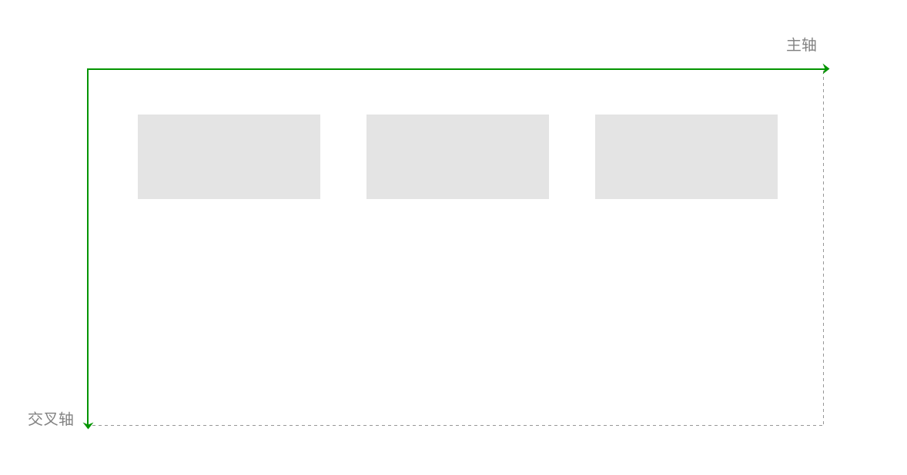
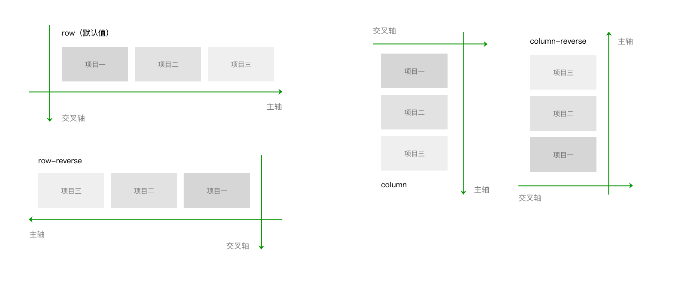
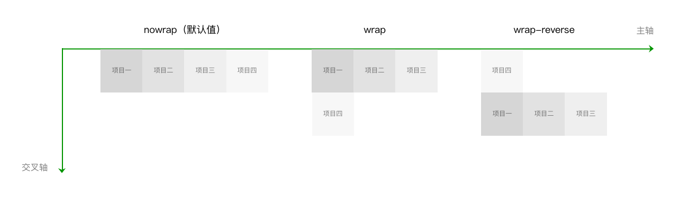
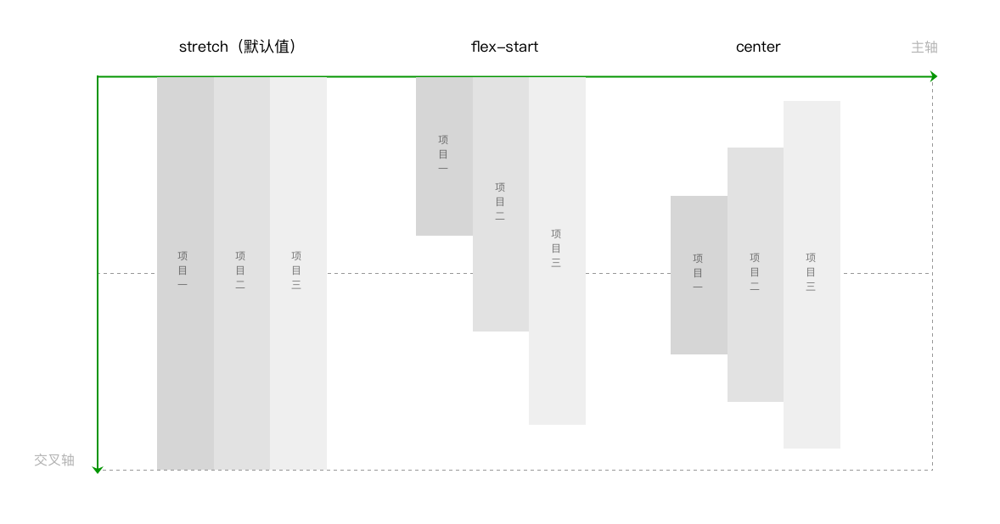
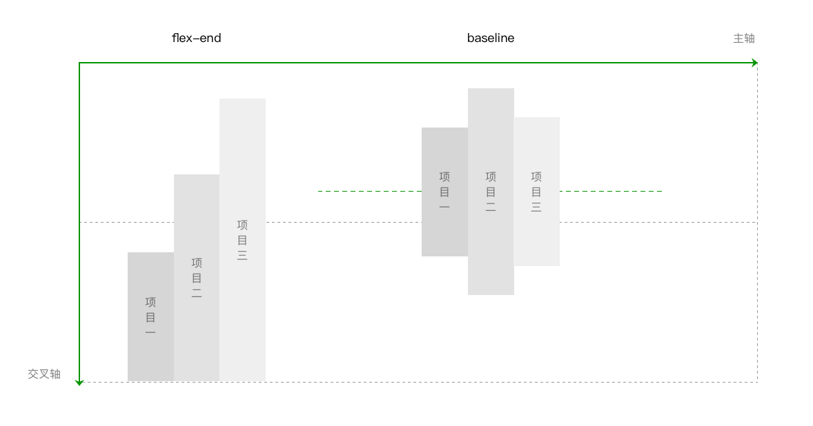
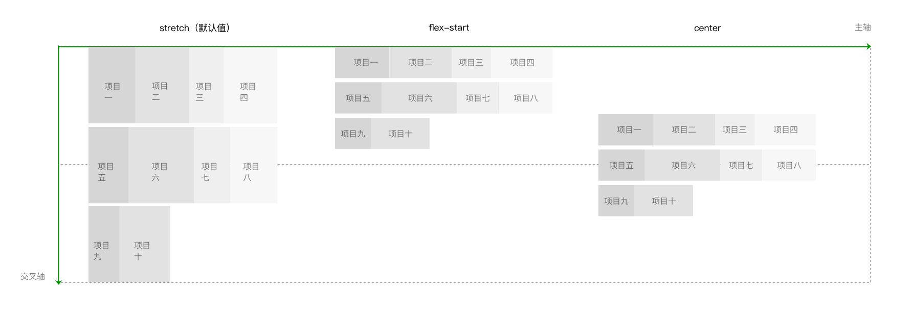
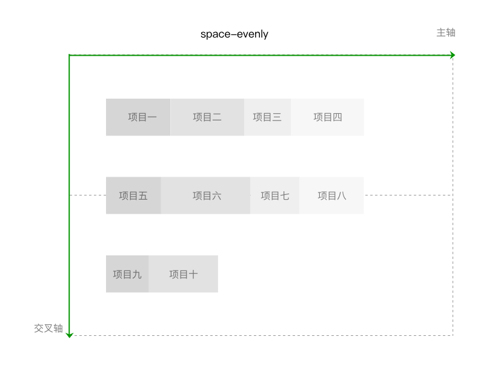

# 小程序的场景应用——Flex布局

[toc]

## 一、基本的布局方法——Flex布局

https://developers.weixin.qq.com/miniprogram/dev/framework/quickstart/

### （1）什么是Flex布局

约定几个术语：

- 采用flex布局的元素，简称为“容器”，在代码示例中以container表示容器的类名；
- 容器内的元素简称为“项目”，在代码示例中以item表示项目的类名；

flex的概念最早是在2009年被提出，目的是提供一种更灵活的布局模型，使容器能通过改变里面项目的高宽、顺序，来对可用空间实现最佳的填充，方便适配不同大小的内容区域。

Flex 是一套新的属性集。这个属性集包括用于设置容器，和用于设置项目两部分。

容器属性：

```
display:flex;

flex-direction:row（默认值） | row-reverse | column |column-reverse

flex-wrap:nowrap（默认值） | wrap | wrap-reverse

justify-content:flex-start（默认值） | flex-end | center |space-between | space-around | space-evenly

align-items:stretch（默认值） | center  | flex-end | baseline | flex-start

align-content:stretch（默认值） | flex-start | center |flex-end | space-between | space-around | space-evenly
```

设置项目属性：

```
order:0（默认值） | <integer>

flex-shrink:1（默认值） | <number>

flex-grow:0（默认值） | <number>

flex-basis:auto（默认值） | <length>

flex:none | auto | @flex-grow @flex-shrink @flex-basis

align-self:auto（默认值） | flex-start | flex-end |center | baseline| stretch
```

坐标轴：

默认的情况下，水平方向的是主轴（main axis），垂直方向的是交叉轴（cross axis）。



### （2）容器属性

#### （1）`flex-direction` 属性：通过设置坐标轴，来设置项目排列方向

```css
.container{
  flex-direction: row（默认值） | row-reverse | column | column-reverse
}
```

row（默认值）：主轴横向，方向为从左指向右。项目沿主轴排列，从左到右排列。

row-reverse：row的反方向。主轴横向，方向为从右指向左。项目沿主轴排列，从右到左排列。

column：主轴纵向，方向从上指向下。项目沿主轴排列，从上到下排列。

column-reverse：column的反方向。主轴纵向，方向从下指向上。项目沿主轴排列，从下到上排列。



#### （2）`flex-wrap` 属性：设置是否允许项目多行排列，以及多行排列时换行的方向。

```css
.container{
  flex-wrap: nowrap（默认值） | wrap | wrap-reverse
}
```

nowrap（默认值）：不换行。如果单行内容过多，则溢出容器。
wrap：容器单行容不下所有项目时，换行排列。
wrap-reverse：容器单行容不下所有项目时，换行排列。换行方向为wrap时的反方向。



#### （3）`justify-content` 属性：设置项目在主轴方向上对齐方式，以及分配项目之间及其周围多余的空间

```css
.container{

  justify-content: flex-start（默认值） | flex-end | center | space-between | space-around| space-evenly

}
```

flex-start（默认值）：项目对齐主轴起点，项目间不留空隙。

center：项目在主轴上居中排列，项目间不留空隙。主轴上第一个项目离主轴起点距离等于最后一个项目离主轴终点距离。

flex-end：项目对齐主轴终点，项目间不留空隙。
space-between：项目间间距相等，第一个项目离主轴起点和最后一个项目离主轴终点距离为0。
space-around：与space-between相似。不同点为，第一个项目离主轴起点和最后一个项目离主轴终点距离为中间项目间间距的一半。

space-evenly：项目间间距、第一个项目离主轴起点和最后一个项目离主轴终点距离等于项目间间距。


#### （4）`align-items` 属性：设置项目在行中的对齐方式

```css
.container{

  align-items:stretch（默认值） | flex-start | center | flex-end | baseline

}
```

stretch（默认值）：项目拉伸至填满行高。
flex-start：项目顶部与行起点对齐。
center：项目在行中居中对齐。
flex-end：项目底部与行终点对齐。
baseline：项目的第一行文字的基线对齐。





#### （5）`align-content` 属性：多行排列时，设置行在交叉轴方向上的对齐方式，以及分配行之间及其周围多余的空间

```
.container{

  align-content: stretch（默认值） | flex-start | center | flex-end | space-between |space-around | space-evenly

}
```

stretch（默认值）：当未设置项目尺寸，将各行中的项目拉伸至填满交叉轴。当设置了项目尺寸，项目尺寸不变，项目行拉伸至填满交叉轴。

flex-start：首行在交叉轴起点开始排列，行间不留间距。

center：行在交叉轴中点排列，行间不留间距，首行离交叉轴起点和尾行离交叉轴终点距离相等。

flex-end：尾行在交叉轴终点开始排列，行间不留间距。
space-between：行与行间距相等，首行离交叉轴起点和尾行离交叉轴终点距离为0。
space-around：行与行间距相等，首行离交叉轴起点和尾行离交叉轴终点距离为行与行间间距的一半。

space-evenly：行间间距、以及首行离交叉轴起点和尾行离交叉轴终点距离相等。






### （3）项目属性

设置项目，用于设置项目的尺寸、位置，以及对项目的对齐方式做特殊设置。

#### （1）`order` 属性：设置项目沿主轴方向上的排列顺序，数值越小，排列越靠前。属性值为整数

```
.item{

  order: 0（默认值） | <integer>

}
```


#### （2）`flex-shrink`  压缩项目以便于适应容器大小

当项目在主轴方向上溢出时，通过设置项目收缩因子来压缩项目适应容器。属性值为项目的收缩因子，属性值取非负数。

[起步 >小程序开发指南>场景应用>项目属性](https://developers.weixin.qq.com/miniprogram/dev/framework/quickstart/)。

#### （3）`flex-grow` 扩容项目以便于适应容器大小

当项目在主轴方向上还有剩余空间时，通过设置项目扩张因子进行剩余空间的分配。属性值为项目的扩张因子，属性值取非负数。

```
.item{

  flex-grow: 0（默认值） | <number>

}
```

#### （4）`flex-basis` 主轴方向上项目的宽度

当flex-basis和width（或height），其中一个属性值为auto时，非auto的优先级更高。

#### （5）`flex` 属性

是flex-grow，flex-shrink，flex-basis的简写方式。值设置为none，等价于00 auto。值设置为auto，等价于1 1 auto。

````
.item{

  flex: none | auto | @flex-grow @flex-shrink@flex-basis

}
````

#### （6）`align-self`   

设置项目在行中交叉轴方向上的对齐方式，用于覆盖容器的align-items，这么做可以对项目的对齐方式做特殊处理。默认属性值为auto，继承容器的align-items值，当容器没有设置align-items时，属性值为stretch。

```
.item{

  align-self: auto（默认值） | flex-start | center | flex-end | baseline |stretch

}
```

