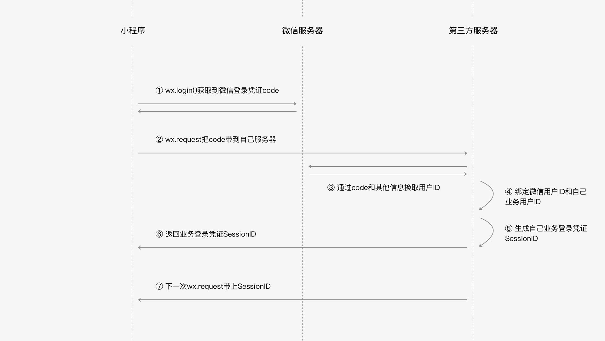

# 文档-小程序的场景应用-微信登陆

[toc]

## 一、微信登录应用到你的小程序中

### （1）获取登陆凭证

**小程序**通过调用`wx.login`从**微信服务器**获取一个时效性的凭证，

> 如果5分钟内小程序的后台不拿着这个临时身份证来微信后台服务器换取微信用户id的话，那么这个身份证就会被作废，需要再调用wx.login重新生成登录凭证。

### （2）将登陆凭证传给开发者服务器

- 在wx.login的success回调中拿到微信登录凭证

- wx.request把code传到开发者服务器，为了后续可以换取微信用户身份id

- 如果当前微信用户还没有绑定当前小程序业务的用户身份，那在这次请求应该顺便把用户输入的帐号密码一起传到后台

  > 然后开发者服务器就可以校验账号密码之后再和微信用户id进行绑定

  这里的帐号密码指的是用户在业务侧的帐号密码，而不是其微信的帐号密码。

### （3）（开发者的后台）到微信服务器获取微信用户身份id、会话密钥session_key

开发者后台拿到登陆凭证，带上AppId和AppSecret，就可以发送请求到微信服务器获取微信用户身份。

```
https://api.weixin.qq.com/sns/jscode2session?appid=<AppId>&secret=<AppSecret>&js_code=<code>&grant_type=authorization_code
```

- AppId是公开信息，泄露AppId不会带来安全风险
- AppSecret是开发者的隐私数据不应该泄露，如果发现泄露需要到小程序管理平台进行重置AppSecret

code在成功换取一次信息之后也会立即失效，即便凭证code生成时间还没过期。

 请求成功后便能得到`openid`、`session_key`：

- `openid`：微信用户的唯一标识
- `session_key`：会话密钥

session_key则是微信服务器给开发者服务器颁发的身份凭证，开发者可以用session_key请求微信服务器其他接口来获取一些其他信息。

**session_key不应该泄露或者下发到小程序前端。**

### （4）绑定微信用户身份id和业务用户身份

将业务侧用户和微信侧身份关联起来，小程序在下次需要用户登录的时候就可以不需要输入账号密码。

### （5）业务登录凭证SessionId

开发者服务器需要生成会话密钥SessionId，用来作为开发者服务器和开发者的小程序的会话密钥。

小程序后续发起的请求中携带上SessionId，开发者服务器就可以通过服务器端的Session信息查询到当前登录用户的身份。



