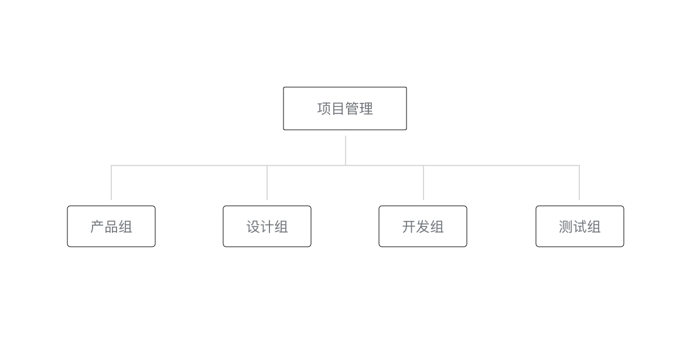
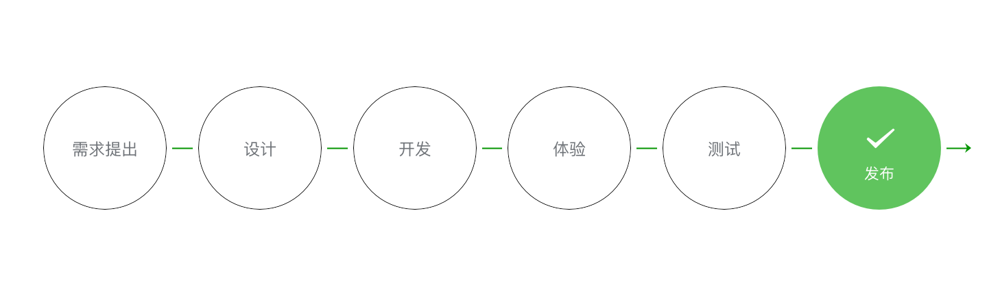

# 协同工作和发布

[toc]

## 一、人员组织和权限分配

### （1）组织架构

项目管理：产品组、设计组、开发组、测试组。

### （2）开发流程

需求提出（产品组）、设计（设计组）、开发（开发组）、体验（产品组和设计组）、测试（测试组）、发布（项目管理）

### （3）权限和权限分配

| **权限**     | **说明**                                                     |
| :----------- | :----------------------------------------------------------- |
| 开发者权限   | 可使用小程序开发者工具及开发版小程序进行开发                 |
| 体验者权限   | 可使用体验版小程序                                           |
| 登录         | 可登录小程序管理后台，无需管理员确认                         |
| 数据分析     | 使用小程序数据分析功能查看小程序数据                         |
| 开发管理     | 小程序提交审核、发布、回退                                   |
| 开发设置     | 设置小程序服务器域名、消息推送及扫描普通链接二维码打开小程序 |
| 暂停服务设置 | 暂停小程序线上服务                                           |

| **成员**       | **权限分配**                       |
| :------------- | :--------------------------------- |
| 项目管理组成员 | 拥有所有权限                       |
| 开发组成员     | 开发者权限 / 体验者权限 / 数据分析 |
| 产品组成员     | 体验者权限 / 数据分析              |
| 测试组成员     | 体验者权限                         |

## 二、小程序的版本

| **权限**   | **说明**                                                     |
| :--------- | :----------------------------------------------------------- |
| 开发版本   | 使用开发者工具，可将代码上传到开发版本中。 开发版本只保留每人最新的一份上传的代码。点击提交审核，可将代码提交审核。开发版本可删除，不影响线上版本和审核中版本的代码。 |
| 体验版本   | 可以选择某个开发版本作为体验版，并且选取一份体验版。         |
| 审核中版本 | 只能有一份代码处于审核中。有审核结果后可以发布到线上，也可直接重新提交审核，覆盖原审核版本。 |
| 线上版本   | 线上所有用户使用的代码版本，该版本代码在新版本代码发布后被覆盖更新。 |

## 三、发布

1. 发布前检查

   - 是否开启“上传代码时样式自动补全”；
   - 网络域名的配置
   - 测试阶段不要打开debug模式；
   - 网络接口部署情况；

2. 发布模式

   全量发布和分阶段发布

