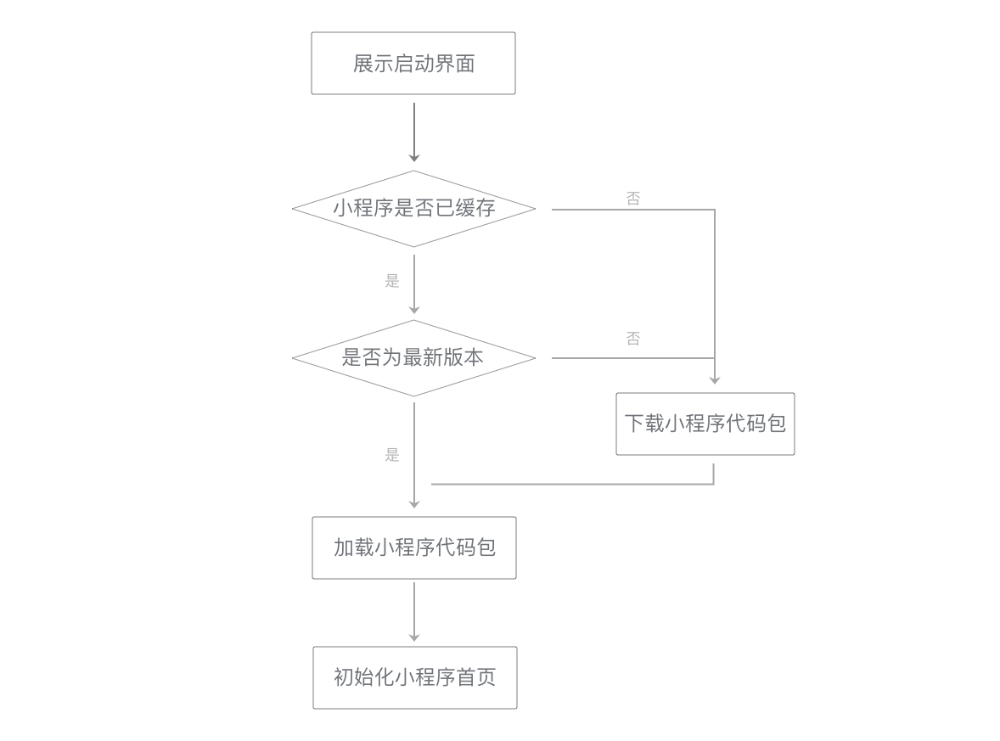
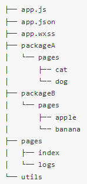

# 小程序的优化

[toc]

## 一、启动小程序

### （1）小程序的启动流程



### （2）代码包的下载

- 在某个小程序第一次启动时，微信需要下载小程序代码包。此后，如果小程序代码包未更新且还被保留在缓存中，则下载小程序代码包的步骤会被跳过。

- 下载到的小程序代码包不是小程序的源代码，而是编译、压缩、打包之后的代码包。

  代码包大小可以在开发者工具的“详情”栏中找到。

- 控制代码包大小有助于减少小程序的启动时间。

  对低于1MB的代码包，其下载时间可以控制在929ms（iOS）、1500ms（Android）内。

控制代码包大小的方法：

1. 精简代码，去掉不必要的WXML结构和未使用的WXSS定义。
2. 减少在代码包中直接嵌入的资源文件。
3. 压缩图片，使用适当的图片格式。

如果小程序比较复杂，优化后的代码总量可能仍然比较大，此时可以采用分包加载的方式进行优化。

### （3）分包加载流程

小程序的代码包可以被划分为几个：

- 一个是“主包”，包含小程序启动时会马上打开的页面代码和相关资源；
- 其余是“分包”，包含其余的代码和资源。

小程序启动时，只需要先将主包下载完成，就可以立刻启动小程序。这样就可以显著降低小程序代码包的下载时间。

一个支持分包的小程序目录结构，代码根目录下有“packageA”和“packageB”两个子目录（它们的名字需要在app.json中声明）：



分包的`app.json`代码：

```
{
  "pages":[
    "pages/index",
    "pages/logs"
  ],
  "subPackages": [
    {
      "root": "packageA",
      "pages": [
        "pages/cat",
        "pages/dog"
      ]
    }, {
      "root": "packageB",
      "pages": [
        "pages/apple",
        "pages/banana"
      ]
    }
  ]
}
```

在小程序启动时，“packageA”和“packageB”两个子目录的内容不会马上被下载下来，只有主包的内容才会被下载。

> 利用这个特性就可以显著降低初始启动时的下载时间。

使用分包时需要注意代码和资源文件目录的划分。启动时需要访问的页面及其依赖的资源文件应放在主包中。

### （4）代码包的加载

1. 小程序的代码包被下载（或从缓存中读取）完成后，小程序的代码会被加载到适当的线程中执行。

2. 所有app.js、页面所在的JS文件和所有其他被require的JS文件会被自动执行一次，小程序基础库会完成所有页面的注册。

   > 在小程序代码调用Page构造器的时候，小程序基础库会记录页面的基础信息，如初始数据（data）、方法等。

3. 如果一个页面被多次创建，并不会使得这个页面所在的JS文件被执行多次，而仅仅是根据初始数据多生成了一个页面实例（this），在页面JS文件中直接定义的变量，在所有这个页面的实例间是共享的。

例如，若从页面A使用wx.navigateTo跳转到页面B，再使用wx.navigateTo跳转到页面A，此时页面栈中有三个页面：A、B、A。

这时两个A页面的实例将共享它的JS文件中Page构造器以外直接定义的变量。

> 有经验的开发者可以利用这个特性，但一些开发者也会错误地共享出一些变量，因而使用时要小心。

```javascript
console.log('加载 page.js')
var count = 0
Page({
  onLoad: function() {
    count += 1
    console.log('第 ' + count + ' 次启动这个页面')
  }
})
```

如果在page.js中加入这段代码，则在小程序代码包加载阶段就会在控制台中输出一段提示语，并在每次页面被创建后输出这是这个页面第几次被创建。

### （5）初始化小程序的首页

在小程序代码包加载完毕后，小程序基础库会根据启动路径选择一个页面来启动。这时会根据页面路径和初始数据创建一个新页面。

## 二、数据通信

主要的优化策略可以归纳为三点：精简代码，降低WXML结构和JS代码的复杂性；合理使用setData调用，减少setData次数和数据量；必要时使用分包优化。

### （1）页面初始数据通信

在小程序启动或一个新的页面被打开时，页面的初始数据（data）和路径等相关信息会从逻辑层发送给视图层，用于视图层的初始渲染。

页面初始化的时间大致由页面初始数据通信时间和初始渲染时间两部分构成。

- 数据通信时间：数据通信的时间指数据从逻辑层开始组织数据到视图层完全接收完毕的时间，数据量小于64KB时总时长可以控制在30ms内。

传输时间与数据量大体上呈现正相关关系，传输过大的数据将使这一时间显著增加。因而减少传输数据量是降低数据传输时间的有效方式。

###  （2）更新数据通信

为了提升数据更新的性能，开发者在执行setData调用时，最好遵循以下原则：

1.不要过于频繁调用setData，应考虑将多次setData合并成一次setData调用；
2.数据通信的性能与数据量正相关，因而如果有一些数据字段不在界面中展示且数据结构比较复杂或包含长字符串，则不应使用setData来设置这些数据；
3.与界面渲染无关的数据最好不要设置在data中，可以考虑设置在page对象的其他字段下。

```
    // 不要频繁调用setData
    this.setData({ a: 1 })
    this.setData({ b: 2 })
    // 绝大多数时候可优化为
    this.setData({ a: 1, b: 2 })
```

### （3）用户事件通信

用户事件的通信比较简单：当一个用户事件被触发且有相关的事件监听器需要被触发时，视图层会将信息反馈给逻辑层。

如果一个事件没有绑定事件回调函数，则这个事件不会被反馈给逻辑层。

> 视图层中有一套高效的事件处理体系，可以快速完成事件生成、冒泡、捕获等过程。

视图层将事件反馈给逻辑层时，同样需要一个通信过程，通信的方向是从视图层到逻辑层。因为这个通信过程是异步的，会产生一定的延迟，延迟时间同样与传输的数据量正相关，数据量小于64KB时在30ms内。降低延迟时间的方法主要有两个：

1.去掉不必要的事件绑定（WXML中的bind和catch），从而减少通信的数据量和次数；
2.事件绑定时需要传输target和currentTarget的dataset，因而不要在节点的data前缀属性中放置过大的数据。

### （4）视图层渲染

在一个页面的生命周期中，视图层会收到一份初始数据和多份更新数据。收到初始数据时需要执行初始渲染，每次收到更新数据时需要执行重渲染。

在这整个流程中，时间开销大体上与节点树中节点的总量成正比例关系。因而**减少WXML中节点的数量可以有效降低初始渲染和重渲染的时间开销，提升渲染性能**。

**去掉不必要设置的数据、减少setData的数据量**也有助于提升这一个步骤的性能。

### （5）原生组件通信

一些原生组件支持使用context来更新组件。不同于setData，使用context来更新组件并不会涉及到重渲染过程，数据通信过程也不同。

使用context时，数据从逻辑层传到native层后，直接传入组件中，这样可以显著降低传输延迟。